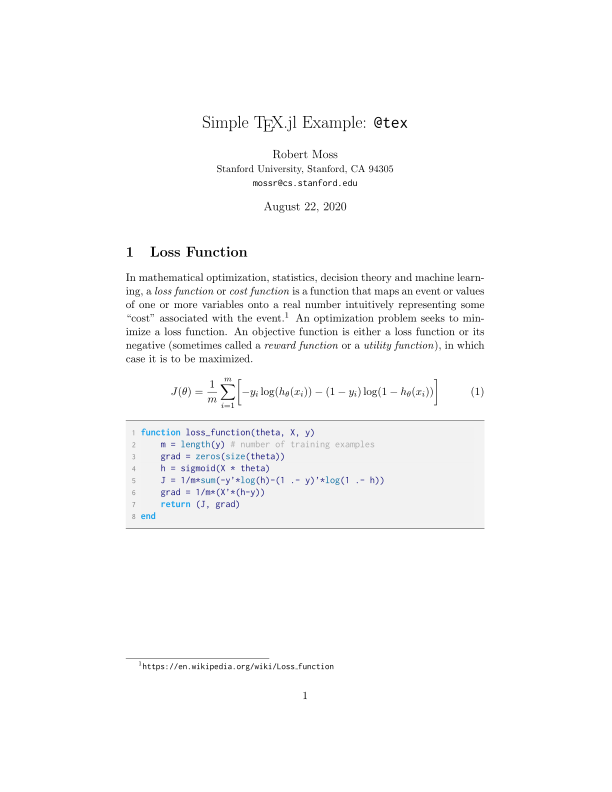
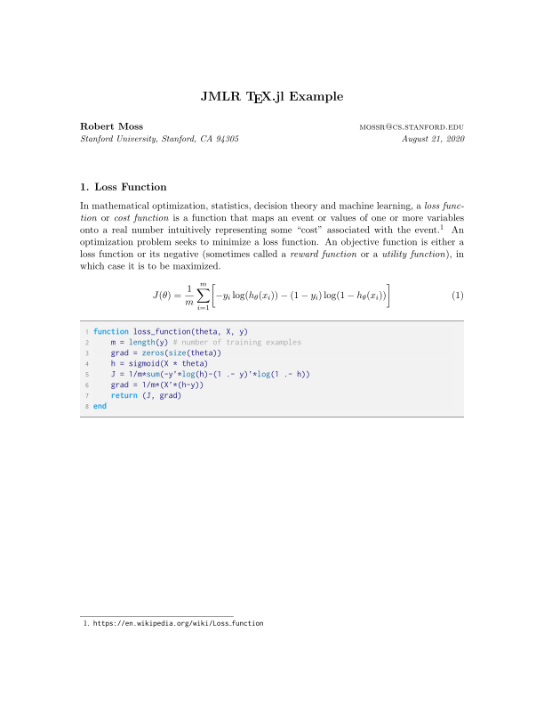
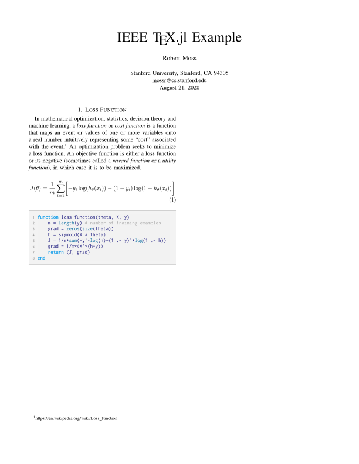
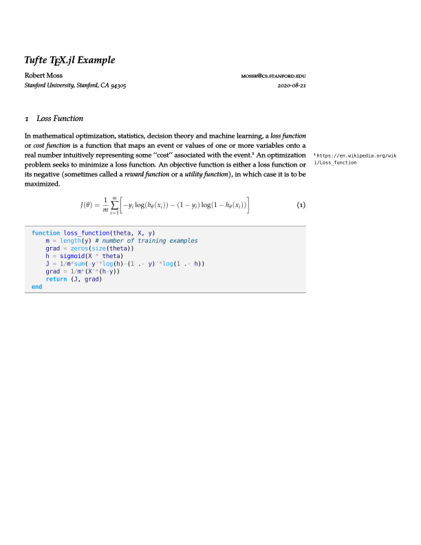
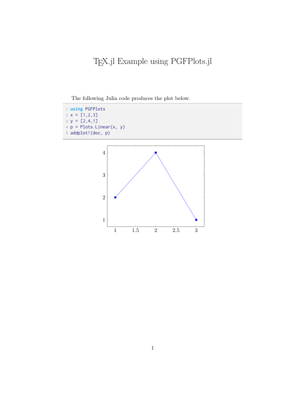
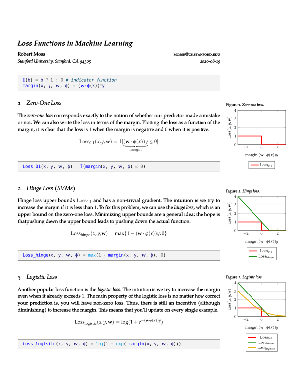

# TeX.jl
`@tex` macro for generating LaTeX PDFs from Julia code with descriptions. Requires `pdflatex`.
We recommend [MiKTeX](https://miktex.org/download) or [TeX Live](https://www.tug.org/texlive/).


## Example
The following Julia code will produce the [`default.pdf`](https://github.com/mossr/TeX.jl/blob/master/test/pdf/default.pdf) file shown below.

```julia
using TeX

doc = TeXDocument("default") # PDF file name
doc.title = T"Simple \TeX.jl Example: \texttt{@tex}" # Use T"..." to escape TeX strings
doc.author = "Robert Moss"
doc.address = "Stanford University, Stanford, CA 94305"
doc.email = "mossr@cs.stanford.edu"
doc.date = T"\today"
addpackage!(doc, "url")

@tex doc T"In mathematical optimization, statistics, decision theory and machine learning,
a \textit{loss function} or \textit{cost function} is a function that maps an event or
values of one or more variables onto a real number intuitively representing some ``cost''
associated with the event.\footnote{\url{https://en.wikipedia.org/wiki/Loss_function}}
An optimization problem seeks to minimize a loss function. An objective function is
either a loss function or its negative (sometimes called a \textit{reward function}
or a \textit{utility function}), in which case it is to be maximized.

\begin{equation}
    J(\theta) = \frac{1}{m}\sum_{i=1}^{m}\biggl[ -y_i \log(h_{\theta}(x_i)) -
                    (1 - y_i) \log(1 - h_{\theta}(x_i)) \biggr]
\end{equation}" ->
function loss_function(theta, X, y)
    m = length(y) # number of training examples
    grad = zeros(size(theta))
    h = sigmoid(X * theta)
    J = 1/m * sum((-y'*log(h))-(1 .- y)'*log(1 .- h))
    grad = 1/m*(X'*(h-y))
    return (J, grad)
end

texgenerate(doc) # Compile the document to PDF
```

The output PDF is generated using `pdflatex`.
The PDF includes title cased function names as sections with descriptions above the Julia function in a `lstlisting` environment.
Multiple functions with `@tex` can be used in the same file, see the [Advanced Example](https://github.com/mossr/TeX.jl/#advanced-example) below.

Extending the same example as above, we can change the style of the document:
- [JMLR](https://www.jmlr.org/format/format.html) style:
  - ```julia
    doc.jmlr = true
    doc.title = T"JMLR \TeX.jl Example"
    texgenerate(doc)
    ``` 
- [IEEETran](https://ctan.org/pkg/ieeetran?lang=en#:~:text=IEEEtran%20%E2%80%93%20Document%20class%20for%20IEEE,Sources) style:
  - ```julia
    doc.ieee = true
    doc.title = T"IEEE \TeX.jl Example"
    texgenerate(doc)
    ``` 
- [Tufte](https://ctan.org/pkg/tufte-latex?lang=en) style:
  - ```julia
    doc.tufte = true
    doc.title = T"Tufte \TeX.jl Example"
    texgenerate(doc)
    ``` 


*Click to view PDFs*

Default | JMLR
:---------------:|:----:
<kbd> <a href="./test/pdf/default.pdf"></a> </kbd> | <kbd> <a href="./test/pdf/jmlr.pdf"></a> </kbd>

IEEE | Tufte 
:---:|:-----:
<kbd> <a href="./test/pdf/ieee.pdf"></a> </kbd> | <kbd> <a href="./test/pdf/tufte.pdf"></a> </kbd>


### Tufte Style
The Tufte style will run slower (hence, optional) and uses `lualatex` and `pythontex`.
The output PDF uses the `algorithm` and `juliaverbatim` environments included in a custom `tufte-writeup.cls`.


## PGFPlots.jl Example
This package also integrates with [PGFPlots.jl](https://github.com/JuliaTeX/PGFPlots.jl). A simple plotting example is shown below and outputs the [`pgfplots.pdf`](https://github.com/mossr/TeX.jl/blob/master/test/pdf/pgfplots.pdf) file.

```julia
using TeX

doc = TeXDocument("pgfplots"; title=T"\TeX.jl Example using PGFPlots.jl")
addpdfplots!(doc)

@tex doc "The following Julia code produces the plot below." ->
begin
    using PGFPlots
    x = [1,2,3]
    y = [2,4,1]
    p = Plots.Linear(x, y)
    addplot!(doc, p)
end

texgenerate(doc)
```

<kbd>
<p align="center">
  <a href="./test/pdf/pgfplots.pdf">
    
  </a>
</p>
</kbd>


## Advanced Example
A full showcase of the `@tex` macro using PGFPlots.jl and the Tufte-style class is shown below (producing the [`ml.pdf`](https://github.com/mossr/TeX.jl/blob/master/test/pdf/ml.pdf) file). Note that the margin figures are generated using the exact Julia code shown within the document.
```julia
using TeX
using PGFPlots
using LinearAlgebra

doc = globaldoc("ml"; tufte=true)
doc.title = "Loss Functions in Machine Learning"
doc.author = "Robert Moss"
doc.address = "Stanford University, Stanford, CA 94305"
doc.email = "mossr@cs.stanford.edu"
doc.date = T"\today"
doc.auto_sections = false # do not create new \sections for @tex'd functions

@tex begin
    𝕀(b) = b ? 1 : 0 # indicator function
    margin(x, y, 𝐰, φ) = (𝐰⋅φ(x))*y
end

@tex T"""\section{Zero-One Loss}
The \textit{zero-one loss} corresponds exactly to the notion of whether our
predictor made a mistake or not. We can also write the loss in terms of the margin.
Plotting the loss as a function of the margin, it is clear that the loss is $1$
when the margin is negative and $0$ when it is positive.
\[
    \ZeroOneLoss(x, y, \w) =
        \mathbb{1}[\underbrace{(\vec{w} \cdot \phi(x)) y}_{\rm margin} \le 0]
\]
""" ->
Loss_01(x, y, 𝐰, φ) = 𝕀(margin(x, y, 𝐰, φ) ≤ 0)

plot_01 = Plots.Linear(x->Loss_01(x, 1, [1], x->x), (-3,3), xbins=1000,
                       style="solid, ultra thick, mark=none, red",
                       legendentry=L"\ZeroOneLoss")
ax = Axis([plot_01],
          ymin=0, ymax=4,
          xlabel=L"{\rm margin}~(\mathbf{w}\cdot\phi(x))y",
          ylabel=L"\Loss(x,y,\mathbf{w})",
          style="ymajorgrids, enlarge x limits=0, ylabel near ticks",
          legendPos="north west",
          legendStyle="{at={(0.5,-0.5)},anchor=north}",
          width="5cm", height="4cm")

addplot!(ax; figure=true, figtype="marginfigure", figure_pos="-6cm",
         caption="\\textit{Zero-one loss}.", caption_pos=:above)


@tex T"""\section{Hinge Loss (SVMs)}
Hinge loss upper bounds $\ZeroOneLoss$ and has a non-trivial gradient.
The intuition is we try to increase the margin if it is less than $1$.
Minimizing upper bounds are a general idea; the hope is that pushing
down the upper bound leads to pushing down the actual function.
\[
    \HingeLoss(x, y, \w) = \max\{1 - (\w \cdot \phi(x)) y, 0 \}
\]
""" ->
Loss_hinge(x, y, 𝐰, φ) = max(1 - margin(x, y, 𝐰, φ), 0)

plot_hinge = Plots.Linear(x->Loss_hinge(x, +1, [1], x->x), (-3,3),
                          style="solid, ultra thick, mark=none, darkgreen",
                          legendentry=L"\HingeLoss")
ax.plots = [plot_01, plot_hinge]

addplot!(ax; figure=true, figtype="marginfigure", figure_pos="-6cm",
         caption="\\textit{Hinge loss}.", caption_pos=:above)


@tex T"""\section{Logistic Loss}
Another popular loss function is the \textit{logistic loss}.
The intuition is we try to increase the margin even when it already exceeds $1$.
The main property of the logistic loss is no matter how correct your prediction is,
you will have non-zero loss. Thus, there is still an incentive (although diminishing)
to increase the margin. This means that you'll update on every single example.
\[
    \LogisticLoss(x, y, \w) = \log(1 + e^{-(\w \cdot \phi(x)) y})
\]
""" ->
Loss_logistic(x, y, 𝐰, φ) = log(1 + exp(-margin(x, y, 𝐰, φ)))

plot_logistic = Plots.Linear(x->Loss_logistic(x, +1, [1], x->x), (-3,3),
                             style="solid, ultra thick, mark=none, sun",
                             legendentry=L"\LogisticLoss")
ax.plots = [plot_01, plot_hinge, plot_logistic]

addplot!(ax; figure=true, figtype="marginfigure", figure_pos="-6cm",
         caption="\\textit{Logistic loss}.", caption_pos=:above)

# note, content from CS221 at Stanford
texgenerate()
```

<kbd>
<p align="center">
  <a href="./test/pdf/ml.pdf">
    
  </a>
</p>
</kbd>

### Other Examples
For other examples, see the test files inside the [`test/`](https://github.com/mossr/TeX.jl/blob/master/test/) directory.


## Installation
```julia
] add https://github.com/mossr/TeX.jl
```

### Tufte-style Installation (`pythontex`)
_These steps are only required if you set `doc.tufte=true`._

This requires `lualatex` and `pythontex`.
You can download the latest version of pythontex from https://github.com/gpoore/pythontex.

Initialize and update the submodules:
```
git submodule init
git submodule update
```

Compile the style:
```
cd style
sudo python setup.py install
cd ..
```

Compile the lexer:
```
cd lexer
sudo python setup.py install
cd ..
```
