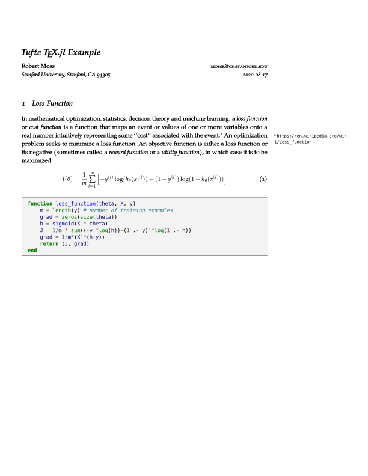

# TeX.jl
`@tex` macro for generating LaTeX PDFs from Julia code with descriptions. Requires `pdflatex`.
We recommend [MiKTeX](https://miktex.org/download) or [TeX Live](https://www.tug.org/texlive/).

### Installation
```julia
] add https://github.com/mossr/TeX.jl
```

#### Tufte-style Installation
_These steps are only required if you set `TeXDocument(;tufte=true)`._
This requires `lualatex` and `pythontex`.
You can download the latest version of pythontex from https://github.com/gpoore/pythontex.

Initialize and update the submodules:
```
git submodule init
git submodule update
```

Compile the style:
```
cd style
sudo python setup.py install
cd ..
```

Compile the lexer:
```
cd lexer
sudo python setup.py install
cd ..
```


## Example
The following Julia code will produce the [`main.pdf`](https://github.com/mossr/TeX.jl/blob/master/test/main.pdf) file shown below.

```julia
using TeX

doc = TeXDocument("main")
doc.title = T"Simple \TeX.jl Example: \texttt{@tex}" # Use T"..." to escape TeX strings
doc.author = "Robert Moss"
doc.address = "Stanford University, Stanford, CA 94305"
doc.email = "mossr@cs.stanford.edu"
doc.date = T"\today"
addpackage!(doc, "url")

@tex doc T"In mathematical optimization, statistics, decision theory and machine learning,
a \textit{loss function} or \textit{cost function} is a function that maps an event or
values of one or more variables onto a real number intuitively representing some ``cost''
associated with the event.\footnote{\url{https://en.wikipedia.org/wiki/Loss_function}}
An optimization problem seeks to minimize a loss function. An objective function is
either a loss function or its negative (sometimes called a \textit{reward function}
or a \textit{utility function}), in which case it is to be maximized.

\begin{equation}
J(\theta) = \frac{1}{m}\sum_{i=1}^{m}\left[ -y^{(i)} \log(h_{\theta}(x^{(i)})) -
                (1 - y^{(i)}) \log(1 - h_{\theta}(x^{(i)}))\right]
\end{equation}" ->
function loss_function(theta, X, y)
    m = length(y) # number of training examples
    grad = zeros(size(theta))
    h = sigmoid(X * theta)
    J = 1/m * sum((-y'*log(h))-(1 .- y)'*log(1 .- h))
    grad = 1/m*(X'*(h-y))
    return (J, grad)
end

texgenerate(doc) # Compile the document to PDF
```

The output PDF is generated using `pdflatex`.
The PDF includes title cased function names as sections with descriptions above the Julia function in a `lstlisting` environment.
Multiple functions with `@tex` can be used in the same file, see [`test_full.jl`](https://github.com/mossr/TeX.jl/blob/master/test/test_full.jl) for examples.

<kbd>
<p align="center">
  
</p>
</kbd>


## Tufte Example
Extending the same example as above, adding the following Julia code will produce the [`tufte.pdf`](https://github.com/mossr/TeX.jl/blob/master/test/tufte.pdf) file shown below.

```julia
doc.tufte = true
doc.jobname = "tufte" # PDF file name
doc.title = T"Tufte \TeX.jl Example"
texgenerate(doc)
```

This runs slower (hence, optional) and uses `lualatex` and `pythontex`.
The output PDF uses the `algorithm` and `juliaverbatim` environments with a custom `tufte-writeup.cls`.

<kbd>
<p align="center">
  
</p>
</kbd>

### Other Examples
For other examples, see the test files inside the `test/` directory.
